# Domain Generalisation on PACS

Train on some visual styles, classify images from a style never seen during
training. Four domains, seven shared classes, 9,991 images:

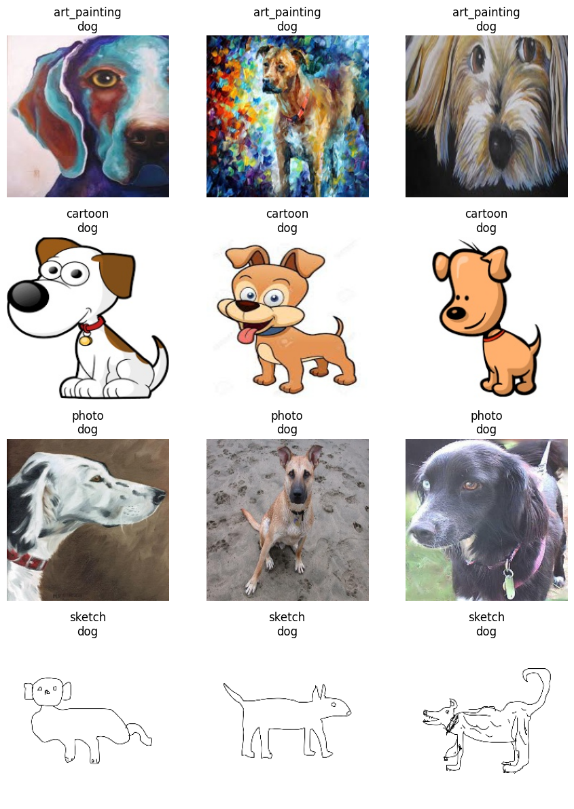

| domain | images | dog | elephant | giraffe | guitar | horse | house | person |
|---|---|---|---|---|---|---|---|---|
| `art_painting` | 2,048 | 379 | 255 | 285 | 184 | 201 | 295 | 449 |
| `cartoon` | 2,344 | 389 | 457 | 346 | 135 | 324 | 288 | 405 |
| `photo` | 1,670 | 189 | 202 | 182 | 186 | 199 | 280 | 432 |
| `sketch` | 3,929 | 772 | 740 | 753 | 608 | 816 | 80 | 160 |

The per-domain class balance is very uneven — sketch has 816 horses and 80
houses, photo has 280 houses and 199 horses — so per-domain majority-class
accuracy, not 1/7, is the floor worth comparing against.

Three notebooks, in increasing order of what they are allowed to assume:

| notebook | what it does |
|---|---|
| [01_erm_baselines.ipynb](notebooks/01_erm_baselines.ipynb) | chance level, linear probes, pairwise transfer between domains, leave-one-domain-out with and without augmentation |
| [02_dann_adversarial_alignment.ipynb](notebooks/02_dann_adversarial_alignment.ipynb) | domain-adversarial training with a gradient reversal layer, target `cartoon`, t-SNE of the feature space before and after |
| [03_flatness_aware_optimisers.ipynb](notebooks/03_flatness_aware_optimisers.ipynb) | leave-one-domain-out done properly (one batch per source domain per step), comparing SGD, Adam, BatchNorm freezing, FAD and MIRO |

`ResNet18` pretrained on ImageNet throughout. [docs/report.md](docs/report.md)
is the write-up.

## Results

### Pairwise transfer

Fine-tune on one domain, evaluate on each of the other three. Rows are the
training domain; the diagonal is blank because a model is never evaluated on
the domain it was trained on.

| train ↓ / test → | art_painting | cartoon | photo | sketch |
|---|---|---|---|---|
| **art_painting** | — | 52.77 | 95.69 | 44.03 |
| **cartoon** | 60.74 | — | 83.23 | 60.88 |
| **photo** | 59.57 | 22.70 | — | 26.65 |
| **sketch** | 22.27 | 34.00 | 21.98 | — |

art_painting → photo transfers at 95.69% and photo → cartoon at 22.70%: the
gap is not symmetric and not a function of "distance between styles". Training
on the stylised domains generalises to photo far better than the reverse,
which is what you would expect from a backbone pretrained on photographs —
photo is already in the features, the stylised domains are not.

### Leave-one-domain-out

Three domains in, the fourth held out. Augmentation is colour jitter,
Gaussian blur and additive Gaussian noise on the source domains only.

| held-out domain | no augmentation | with augmentation |
|---|---|---|
| `art_painting` | 32.08 | **45.02** |
| `cartoon` | 52.47 | **66.13** |
| `photo` | 58.80 | **75.09** |
| `sketch` | 57.16 | **57.67** |

Augmentation buys 13–16 points on three domains and 0.5 on sketch. Sketches
are line drawings — colour jitter and blur do not produce anything closer to
a sketch, so the one domain that needs help gets none. These numbers come from
notebook 01, whose training loop runs one full pass per domain in sequence
rather than mixing domains within a batch; notebook 03 fixes that and reaches
much higher on the same held-out domains.

### DANN (target `cartoon`)

| | by domain | by class |
|---|---|---|
| **before training** | 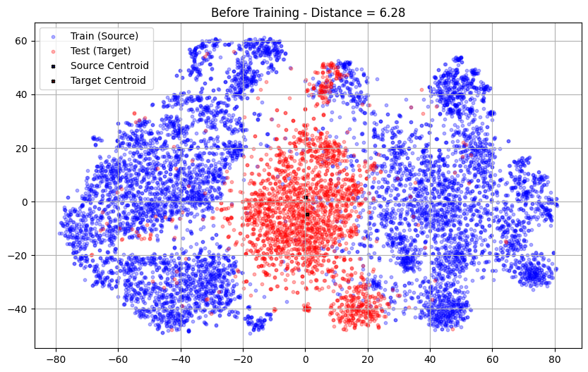 | 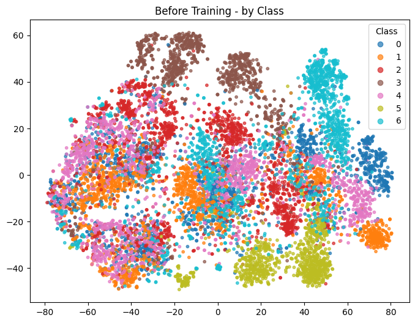 |
| **after 4 epochs** | 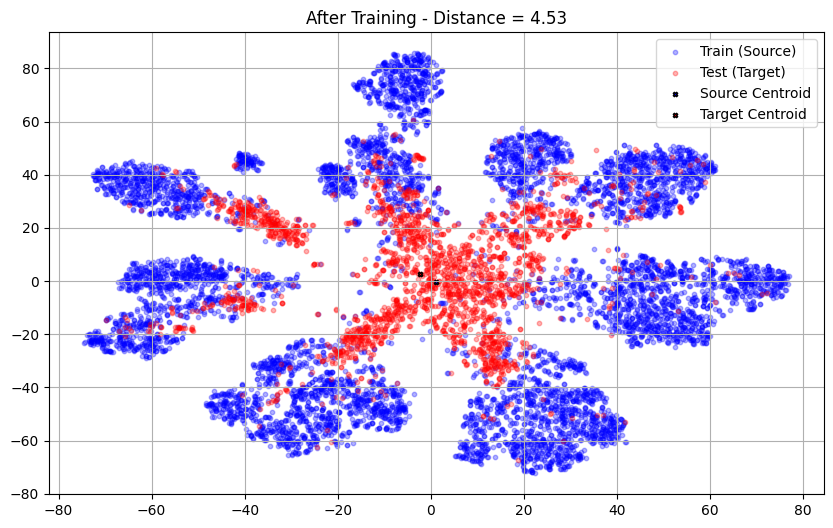 | 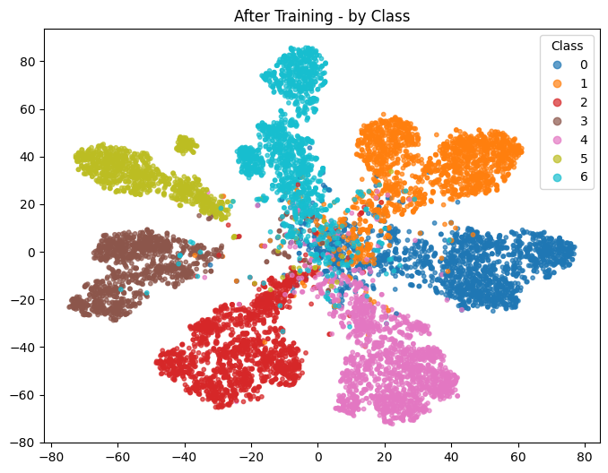 |

Source/target centroid distance in the embedding falls from 6.2817 to 4.5311,
and the class structure that is absent before training is clearly present
after it. Target accuracy goes from 17.11% at initialisation to **71.67%**.

Against cartoon's own leave-one-out baselines — 52.47% plain, 66.13%
augmented — the gain is about 5.5 points, and `lambda_` is set to 6e-5, four
orders of magnitude below the classification gradient, so most of that is
ordinary fine-tuning rather than adversarial alignment. See
[What was corrected](#what-was-corrected).

### Optimisers, leave-one-domain-out done properly

Each step draws one batch of 64 from every source domain and concatenates
them — 192 images spanning three styles in one gradient. 5,000 iterations,
lr 1e-4, 80/20 train/val split per source domain, held-out domain touched
only at the end. Target accuracy:

| optimiser | → sketch | → art_painting |
|---|---|---|
| SGD | 54.01 | 58.64 |
| SGD + frozen BN | 50.98 | 62.35 |
| Adam | 60.96 | 78.76 ¹ |
| FAD + frozen BN | 53.75 | 67.24 |
| MIRO (Adam) + frozen BN | — | 74.32 |

¹ frozen BN.

Combined training curves per run:

| | loss | accuracy |
|---|---|---|
| **sketch**, SGD | 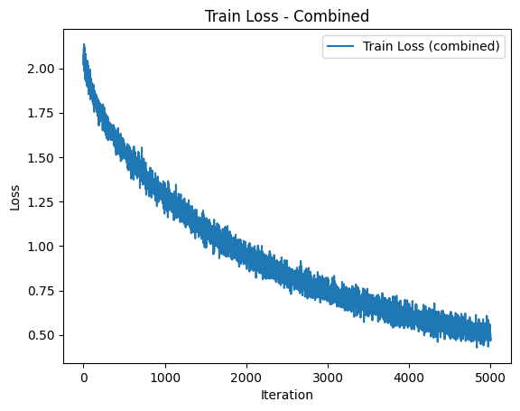 | 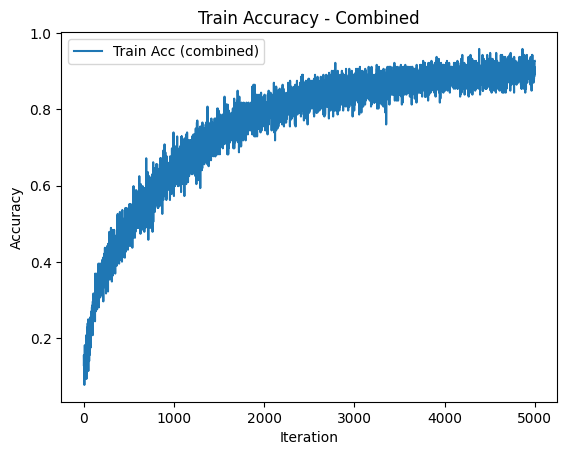 |
| **sketch**, SGD + frozen BN | 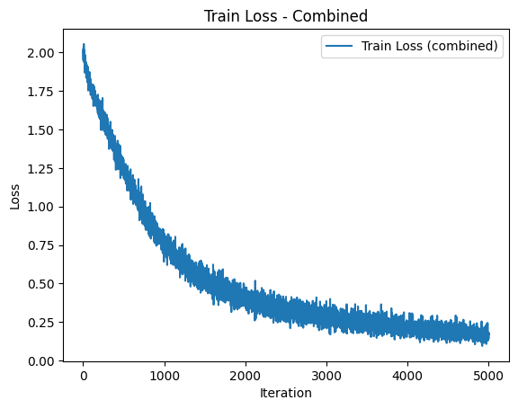 | 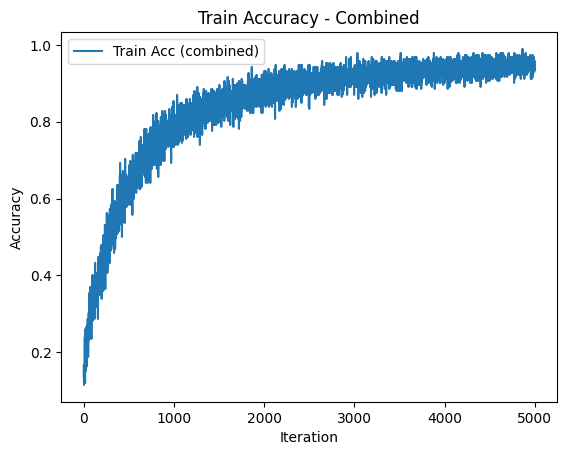 |
| **sketch**, Adam | 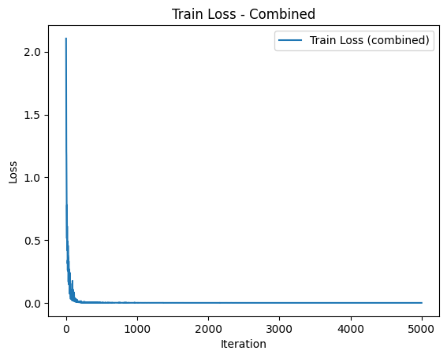 | 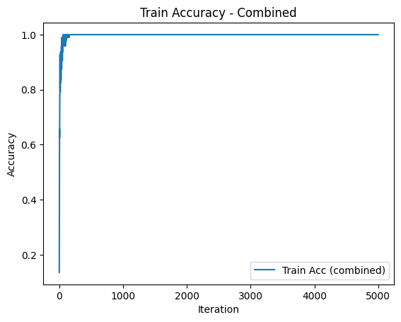 |
| **sketch**, FAD | 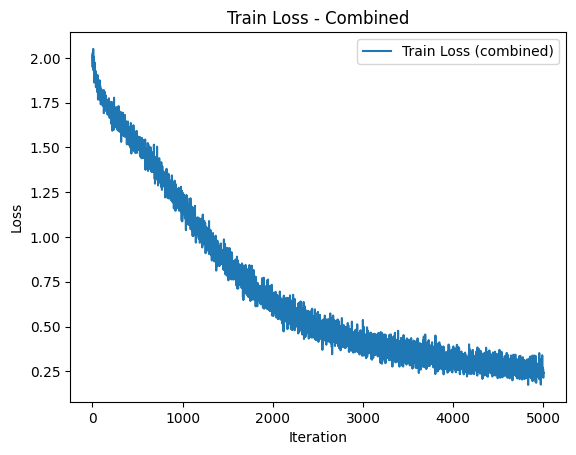 | 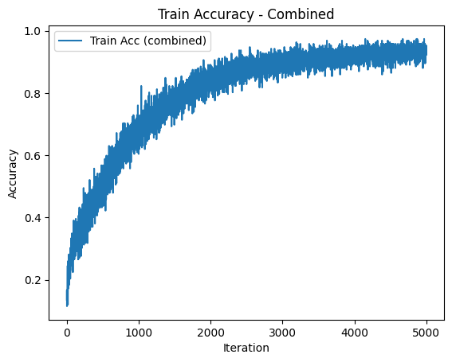 |
| **art**, SGD | 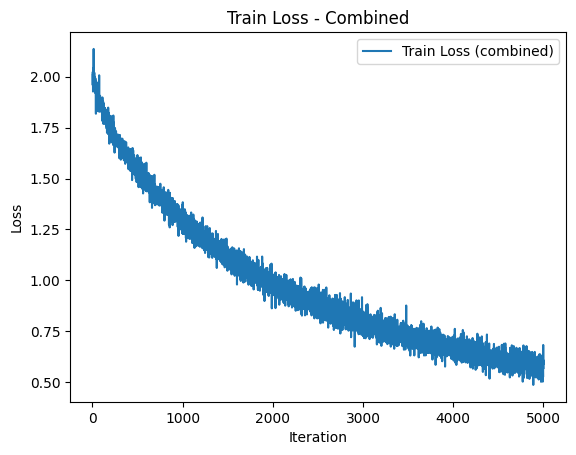 | 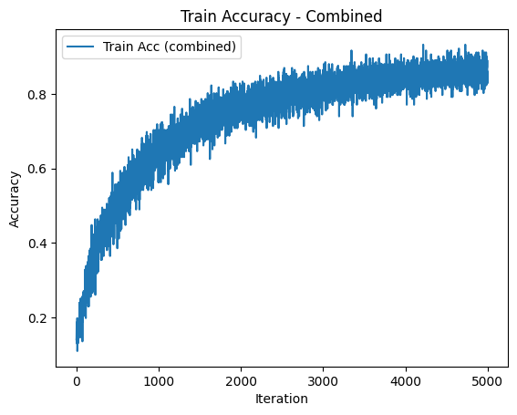 |
| **art**, SGD + frozen BN | 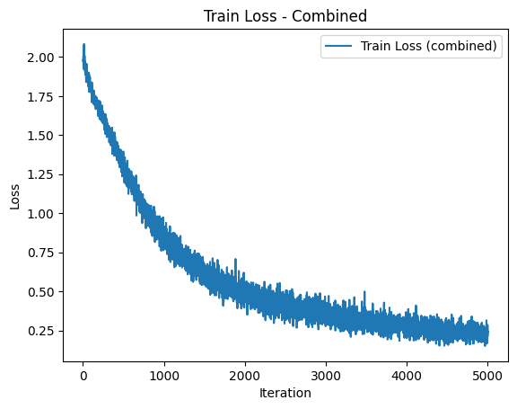 | 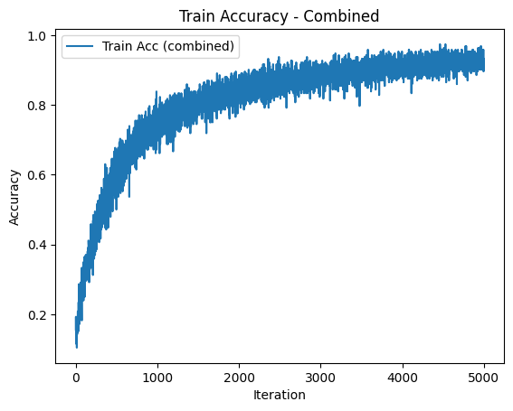 |
| **art**, Adam + frozen BN | 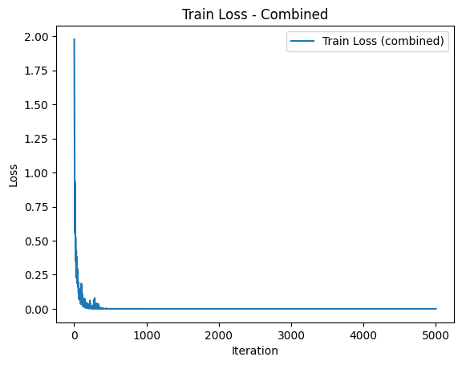 | 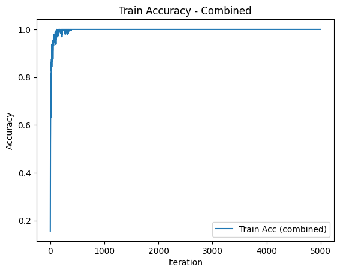 |
| **art**, FAD | 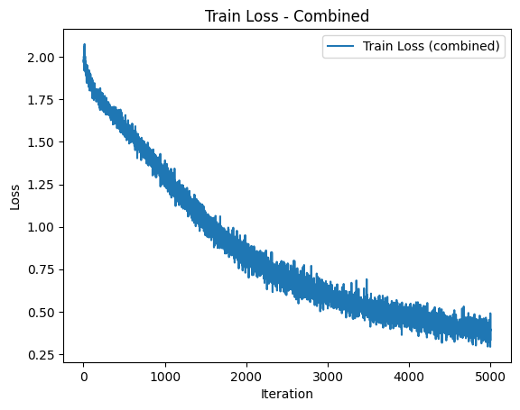 | 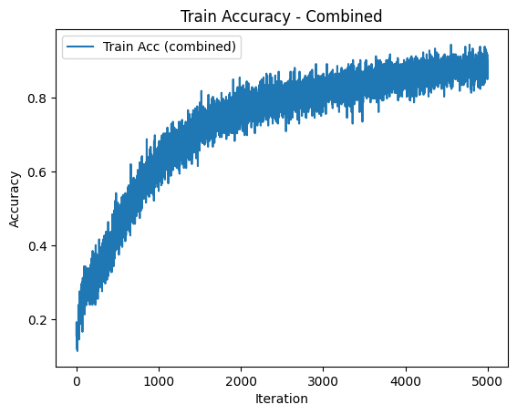 |
| **art**, MIRO | 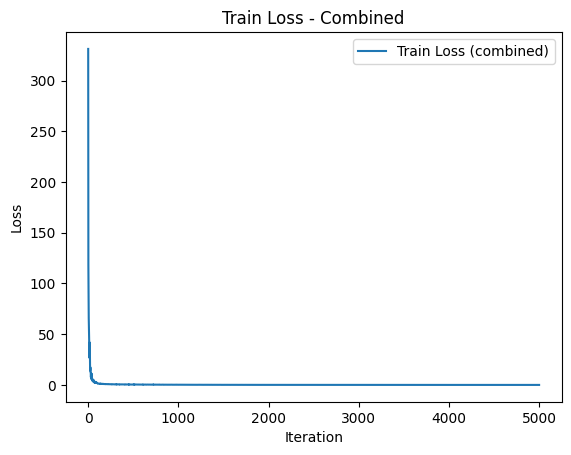 | 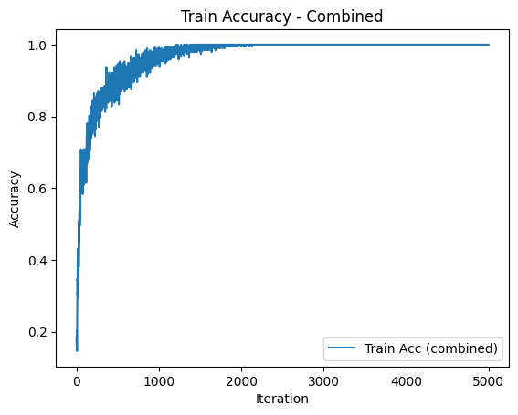 |

Adam is the best optimiser on both targets by a wide margin, and it is also
the one that overfits the source domains hardest. Its per-source-domain
curves, target `art_painting` — train against validation, every 100
iterations:

| source domain | loss | accuracy |
|---|---|---|
| `cartoon` | 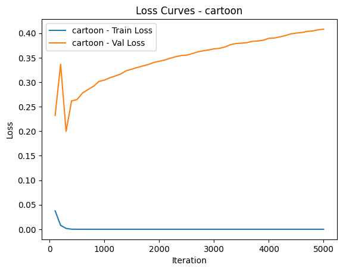 | 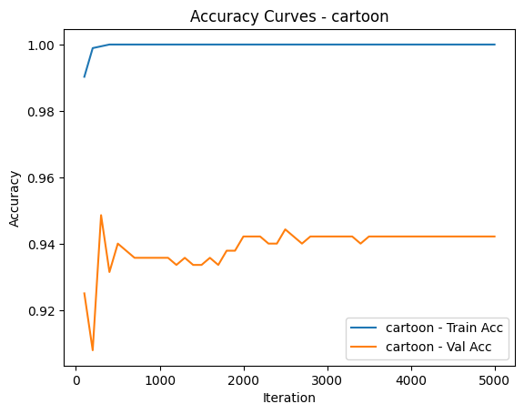 |
| `photo` | 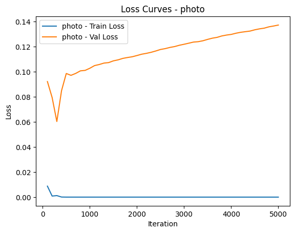 | 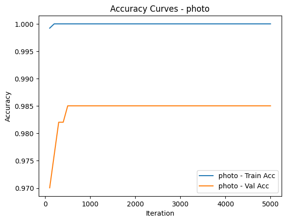 |
| `sketch` | 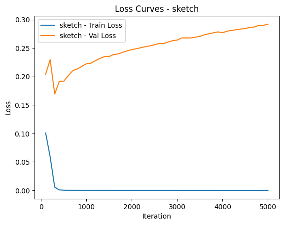 | 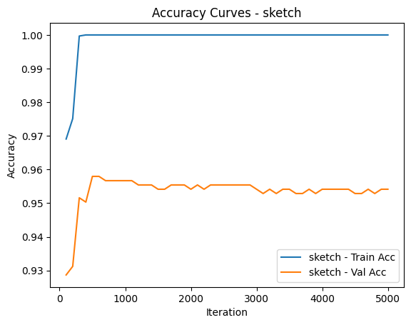 |

Validation loss climbs while validation accuracy holds — the model is getting
more confident about the cases it already gets right and more confidently
wrong about the rest. That is source overfitting, and it is not a reason to
prefer a different optimiser here: under this protocol, accuracy on the
held-out domain *is* the generalisation measurement, and Adam has the best
one. Adam also has the highest test loss of the nine runs (2.0100) and MIRO
the lowest (0.8053) while scoring 4.4 points below it — the KL penalty is
buying calibration, not accuracy.

FAD improves on SGD consistently in sign — +4.9 points on art_painting, +2.8
on sketch — for four gradient evaluations per step instead of one. With one
seed per cell that is suggestive, not established.

## Methods

**DANN.** A shared `ResNet18` feature extractor feeds a 7-way label head
trained on source labels and a binary source/target domain head sitting
behind a *gradient reversal layer* — identity forward, multiplication by
`-lambda` backward. Minimising the domain loss pushes the domain head to
separate the domains while pushing the features to make them inseparable;
the fixed point is a feature space in which domain identity is not
recoverable but class identity still is. `L = L_y(source) + L_d(source + target)`.

**FAD** (flatness-aware descent) minimises zeroth- *and* first-order
flatness together, `R(θ) = α·R⁰(θ) + (1−α)·R¹(θ)`. Zeroth-order flatness is
the largest loss increase in a ρ-ball around θ, which is what SAM minimises;
first-order flatness is the largest gradient norm in that ball, which is what
GAM minimises and which catches sharp directions a zeroth-order measurement
misses. Both are estimated by finite differences of gradients — no Hessian:

```
g0 = ∇L(θ)
g1 = ∇L(θ + ρ·g0/‖g0‖)     h0 = g1 - g0   ≈ ∇R⁰
g2 = ∇L(θ + ρ·h0/‖h0‖)
g3 = ∇L(θ + ρ·g2/‖g2‖)     h1 = g3 - g2   ≈ ∇R¹

θ ← θ - lr·( g0 + β(α·h0 + (1-α)·h1) )
```

ρ = 0.05, α = 0.5, β = 1.0, ξ = 1e-6.

**MIRO** keeps the fine-tuned model near the general-purpose features it
started from: channel-wise means and variances of `layer3` and `layer4` are
read off both the fine-tuned model and a frozen copy of the pretrained one,
treated as diagonal Gaussians, and the KL between them is added to the loss
with weight `miro_lambda` = 0.1. This is the simplified form — the published
method puts a learnable projection between the two feature spaces before
comparing them, which is the single most likely reason it underperforms Adam
here.

**Freezing BatchNorm** holds every `BatchNorm2d` in eval mode with its affine
parameters frozen, so normalisation statistics stay at their ImageNet values
instead of being re-estimated from the source mixture — the premise being
that those statistics are themselves domain-specific. It helps `art_painting`
by 3.7 points and hurts `sketch` by 3.0.

## What was corrected

The notebooks reproduce the original runs; the numbers above are the ones the
code actually produced. Where the original had a defect, the behaviour is
left in place so the reported figures reproduce, and the defect is documented
in a comment at the top of the cell. The substantive ones:

- **The DANN comparison used the wrong baseline.** 71.67% (target `cartoon`)
  was compared against 32.08% and 45.02%, which are `art_painting`'s
  leave-one-out results. Cartoon's are 52.47% and 66.13%, making the real
  gain ~5.5 points rather than ~40.
- **`lambda_ = 6e-5` makes the gradient reversal layer a near no-op.** The
  reversed gradient reaching the feature extractor is ~10⁴ times smaller than
  the classification gradient. The domain head still learns — its own
  gradients are unscaled — but it is not confusing anything. The published
  DANN schedule ramps λ from 0 to ~1 over training.
- **DANN's target accuracy was measured through the augmented transform**, so
  71.67% is accuracy on colour-jittered, blurred, noised cartoons. Notebook
  02 now reports both that number and the clean-transform one.
- **DANN's training accuracy averaged over target samples too**, using target
  labels that are not available under the protocol. Now source-only.
- **The linear-probe accuracies (84–98%) are training accuracies** — the
  evaluation loader was built from `train_dataset`. They are not comparable
  to anything else here, and the original transfer table used them as its
  diagonal while filling the off-diagonal from a different training regime
  (full fine-tune). The diagonal is left blank above.
- **Notebook 01's leave-one-out loop trains sequentially per domain** — one
  full pass over cartoon, then photo, then sketch — so gradients are never
  mixed across domains and each epoch ends biased toward the last loader.
  That is sequential fine-tuning, not ERM over the pooled source
  distribution, and it is why those numbers sit far below both the published
  PACS baselines and notebook 03's. Notebook 03 uses the standard protocol.
- **A three-domain loss sum was divided by the length of whichever loader the
  loop exited on.** Fixed to count batches.
- **MIRO applied the BatchNorm freeze before `model.train()`**, which undoes
  it — `model.train()` walks the module tree and puts every `BatchNorm2d`
  back into training mode. The freeze only took hold at iteration 100, when
  the evaluation block re-applied it, so the first 100 steps updated the
  running statistics. Notebook 03 re-applies the freeze after every
  `model.train()`.
- **The FAD run on `art_painting` printed "Final Evaluation on Target Domain
  (sketch"** — wrong domain, unbalanced paren. The target domain is now a
  parameter.
- **`set_seed` called `np.random.seed` without importing numpy**, which only
  worked because an earlier cell had left `np` bound in the kernel.
- `num_workers=4` in a Windows notebook, a tqdm label reading `Epoch n/5` for
  `range(4)`, epoch numbering starting at 0, an unreachable
  `pip install domainbed.algorithms`, and unused imports: all cleaned up.

The report's own tables also diverge from the notebook's stored output in
places — seven of the pairwise-transfer entries, and `photo`'s linear-probe
accuracy (93.98 vs 98.32) — while the rest match to two decimals, which rules
out a re-run and points to transcription. [docs/report.md](docs/report.md)
uses the notebook's numbers and notes the divergence.

## Running it

```bash
pip install -r requirements.txt
```

The PACS dataset is not committed. Download it and lay it out as
`<root>/<domain>/<class>/*.jpg`, then point the notebooks at it:

```bash
export PACS_ROOT=/path/to/PACS/kfold
```

On Windows PowerShell:

```powershell
$env:PACS_ROOT = "C:\path\to\PACS\kfold"
```

All three notebooks read `PACS_ROOT` and fall back to `PACS/kfold` relative to
the working directory.

A GPU is assumed. Notebook 03's nine runs are ~40 minutes each — 5,000 steps
of 192 images, plus a full pass over six loaders every 100 steps — so the
runs are listed in a `RUNS` table with the call commented out; pick one by
index. Notebooks 01 and 02 are a few minutes each.

## Licence

MIT — see [LICENSE](LICENSE).
